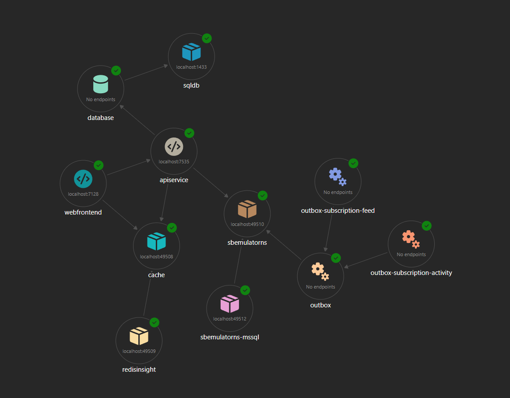
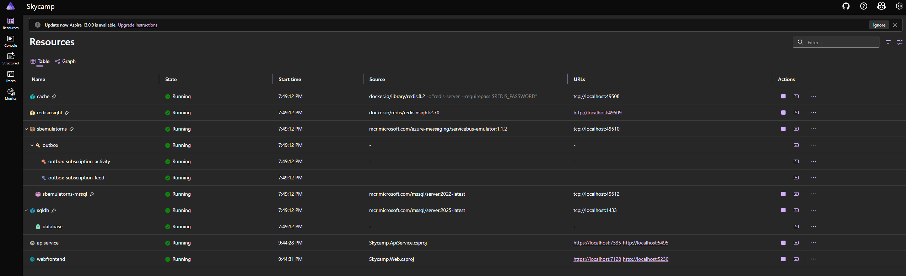
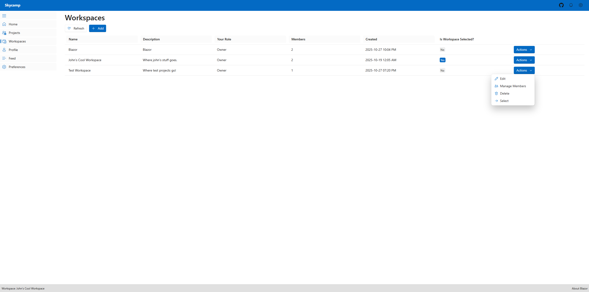
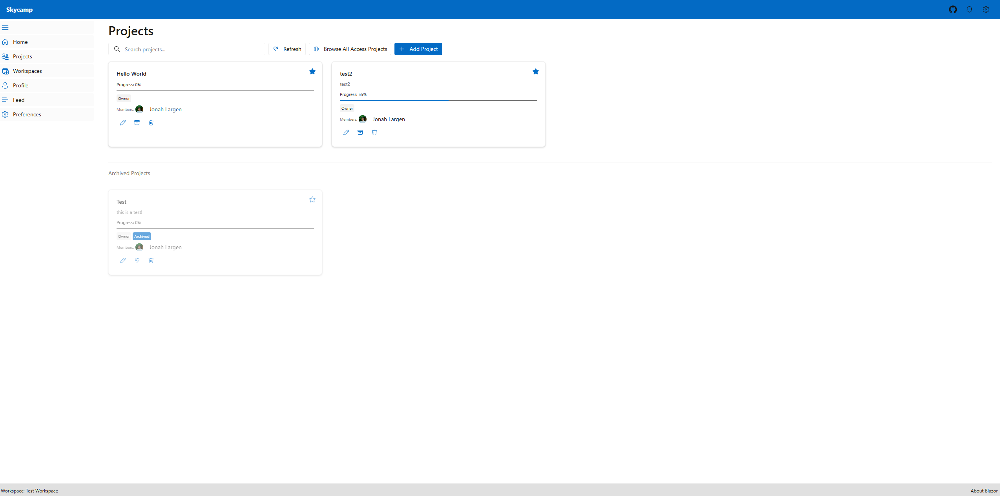
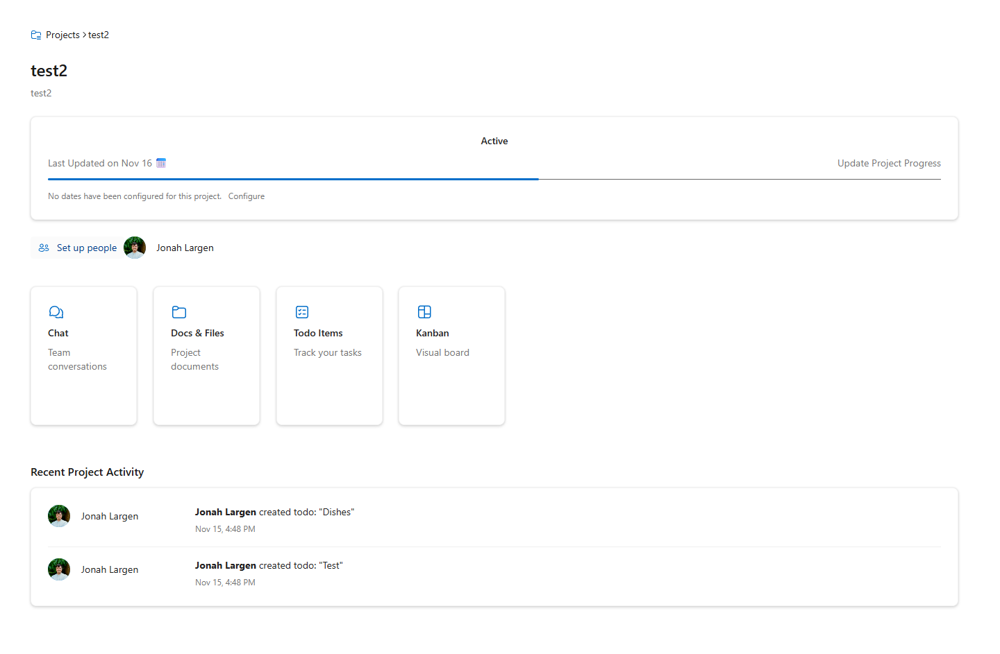
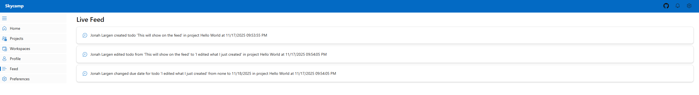
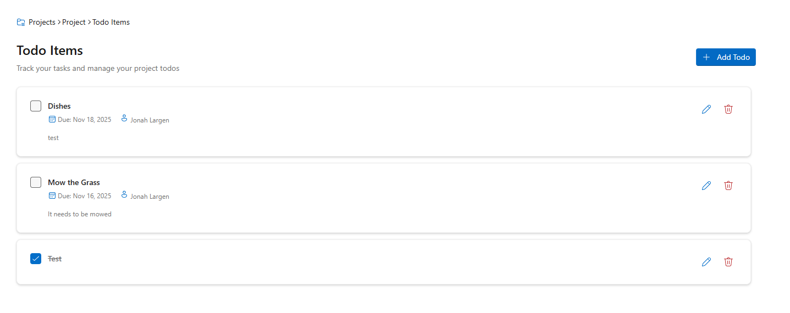
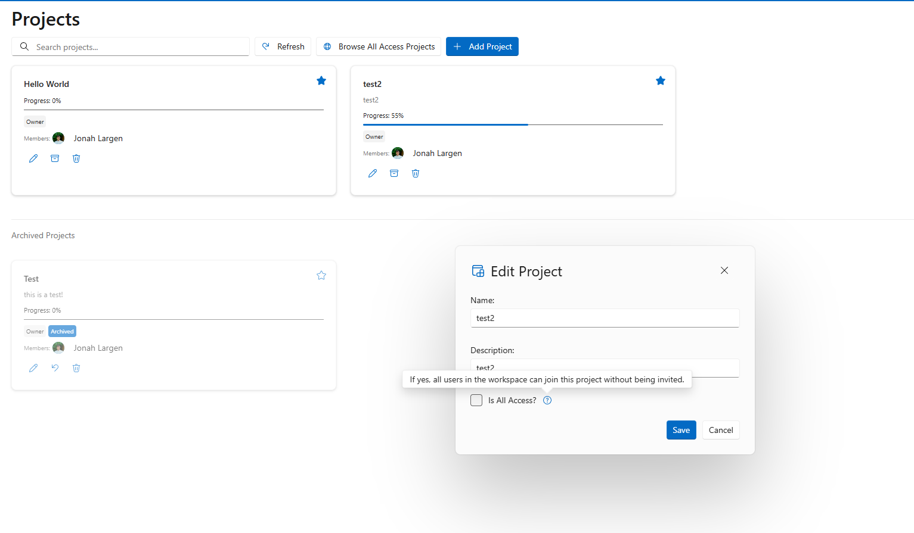

# Skycamp

<div align="center">

**A modern, cloud-native project management platform built with .NET 9 and Blazor**

*Demonstrating enterprise-grade architecture patterns, distributed systems design, and cloud-ready infrastructure*

[](https://dotnet.microsoft.com/)
[](https://dotnet.microsoft.com/apps/aspnet/web-apps/blazor)
[](https://aspire.dev/)
[](LICENSE)

</div>

---

## 🎯 Overview

Skycamp is a project management tool inspired by Basecamp, showcasing best practices in building scalable, maintainable, and secure distributed web applications. Skycamp serves as a comprehensive demonstration of modern .NET architecture patterns, cloud-native design principles, and enterprise development practices.

### What Makes Skycamp Special

- **Production-Ready Architecture**: Implements industry-standard patterns including CQRS, Vertical Slice Architecture, and Outbox Pattern
- **Cloud-Native by Design**: Built with .NET Aspire for seamless orchestration and observability across distributed services
- **Real-Time Capabilities**: SignalR integration for live updates and collaborative features
- **Enterprise Security**: OAuth 2.0 / OpenID Connect with Auth0, role-based access control, and secure API authentication
- **Developer Experience**: Comprehensive observability, health checks, and development tooling through Aspire Dashboard

---

## 📸 Screenshots

### Aspire Dashboard - Resource Graph View

*Visual dependency graph showing service orchestration and resource connections*

### Aspire Dashboard - Table View

*Comprehensive table view of all services, containers, and health status*

### Workspaces Overview

*Organize projects into logical workspaces with role-based access control*

### Projects Dashboard

*Project management dashboard with deadlines and status tracking*

### Project Landing Page

*Clean, modern UI built with Fluent Design principles*

### Live Activity Feed

*Real-time activity updates with SignalR integration*

### Todo Management

*Task tracking with real-time updates and validation*

### Project Settings

*Comprehensive project configuration with role-based access control*

> 📚 **See more screenshots** in the [complete gallery](docs/gallery.md)

---

## 🏗️ Architecture & Design Decisions

### Architectural Patterns

#### 1. **Vertical Slice Architecture**
Rather than organizing code by technical layers (Controllers, Services, Repositories), Skycamp uses vertical slices where each feature contains all the code it needs. This approach:
- Reduces coupling between features
- Makes it easier to understand the full scope of a feature
- Enables independent feature development and testing
- Simplifies onboarding for new developers

```
Features/
├── ProjectManagement/
│   ├── CreateProject/
│   │   ├── Shared/              # Business logic and domain
│   │   └── V1/                  # API endpoint implementation
│   ├── UpdateProject/
│   └── GetProjectById/
```

#### 2. **CQRS (Command Query Responsibility Segregation)**
Commands and queries are separated for better scalability and maintainability:
- **Commands**: Modify state, handled through FastEndpoints with validation
- **Queries**: Read-only operations, optimized separately
- **Middleware Pipeline**: Custom middleware for tracing, logging, and validation

#### 3. **Outbox Pattern for Reliable Messaging**
Ensures reliable event publishing in distributed scenarios:
- Events are persisted to the database within the same transaction as business data
- Background job (Hangfire) publishes messages to Azure Service Bus
- Guarantees at-least-once delivery semantics
- Prevents data inconsistency between database and message bus

#### 4. **Service Mesh with .NET Aspire**
Aspire orchestrates the entire distributed application:
- **Service Discovery**: Automatic endpoint resolution between services
- **Health Checks**: Monitors application and infrastructure health
- **Observability**: Distributed tracing, metrics, and structured logging with OpenTelemetry
- **Resource Management**: Manages databases, caches, and message brokers as first-class resources

### Infrastructure Components

| Component | Purpose | Technology |
|-----------|---------|------------|
| **Web Frontend** | Interactive UI for project management | Blazor Server with Fluent UI |
| **API Service** | RESTful API with versioning support | FastEndpoints, ASP.NET Core |
| **Database** | Persistent storage with full ACID compliance | SQL Server with Entity Framework Core |
| **Cache** | Distributed caching and output caching | Redis with Aspire integration |
| **Message Bus** | Asynchronous event-driven communication | Azure Service Bus (with emulator support) |
| **Background Jobs** | Scheduled tasks and async processing | Hangfire |
| **Real-Time Hub** | WebSocket connections for live updates | SignalR |

---

## 🚀 Key Technologies

### Core Stack
- **.NET 9**: Latest LTS version with performance improvements and native AOT support (requires switch to web assembly for AOT))
- **Blazor Server**: Component-based UI framework with server-side rendering
- **FastEndpoints**: High-performance, REPR pattern alternative to MVC controllers
- **Entity Framework Core 9**: Modern ORM with advanced query capabilities and migrations

### Cloud & Infrastructure
- **.NET Aspire**: Cloud-native orchestration and observability platform
- **Azure Service Bus**: Enterprise message broker with pub/sub patterns
- **Redis**: In-memory data structure store for caching and session management
- **SQL Server**: Enterprise-grade relational database

### Development & Tooling
- **OpenTelemetry**: Distributed tracing and observability
- **Serilog**: Structured logging with multiple sinks
- **FluentValidation**: Type-safe validation with fluent API
- **Hangfire**: Background job processing with persistent storage
- **SignalR**: Real-time bidirectional communication

### Security & Authentication
- **Auth0**: OAuth 2.0 / OpenID Connect identity provider
- **ASP.NET Core Identity**: User management and role-based authorization
- **JWT Bearer Authentication**: Secure API authentication with token validation

### UI Framework
- **Microsoft Fluent UI**: Enterprise design system for Blazor
- **FluentUI Icons & Emoji**: Comprehensive icon library

---

## 📁 Project Structure

```
Skycamp/
│
├── Skycamp.AppHost/                  # Aspire orchestration layer
│   ├── AppHost.cs                    # Service composition and configuration
│   └── appsettings.json              # Environment-specific settings
│
├── Skycamp.ApiService/               # RESTful API service
│   ├── Features/                     # Vertical slices by domain
│   │   ├── ProjectManagement/        # Project/workspace operations
│   │   └── Weather/                  # Sample feature with versioning
│   ├── Data/                         # EF Core DbContext and entities
│   │   ├── ApplicationDbContext.cs
│   │   ├── Identity/                 # User and role entities
│   │   ├── ProjectManagement/        # Domain entities
│   │   └── Messaging/                # Outbox pattern implementation
│   ├── BackgroundServices/           # Long-running hosted services
│   │   ├── FeedSubscriber.cs         # Consumes feed events
│   │   └── ProjectActivitySubscriber.cs
│   ├── Jobs/                         # Scheduled background jobs
│   │   └── OutboxPublisherJob.cs     # Publishes outbox messages
│   ├── Hubs/                         # SignalR hubs for real-time
│   │   └── FeedHub.cs
│   └── Program.cs                    # Service configuration
│
├── Skycamp.Web/                      # Blazor frontend application
│   ├── Components/                   # Blazor components
│   │   ├── Pages/                    # Routable page components
│   │   ├── Dialogs/                  # Modal dialogs
│   │   └── Common/                   # Shared UI components
│   ├── Services/                     # Client-side services
│   ├── Api/                          # API client wrappers
│   └── Program.cs                    # App configuration
│
├── Skycamp.ServiceDefaults/          # Shared configuration
│   └── Extensions.cs                 # Common service registrations
│
├── Skycamp.Contracts/                # Shared contracts
│   └── Events/                       # Event DTOs for messaging
│
└── Skycamp.Tests/                    # Integration tests
    └── IntegrationTests.cs           # Aspire-based integration testing
```

---

## 🎨 Key Features

### Project Management
- **Workspaces**: Organize projects into logical groupings
- **Projects**: Track project details, deadlines, and team members
- **Todos**: Task management with real-time updates
- **Activity Feed**: Live stream of project events and updates
- **Role-Based Access**: Granular permissions at workspace and project levels

### Real-Time Collaboration
- Live activity updates via SignalR
- Instant notifications for project changes
- Collaborative task management

### Developer Features
- API versioning (v1, v2) with Swagger documentation
- Comprehensive health checks
- Distributed tracing across services
- Structured logging with correlation IDs
- Background job dashboard (Hangfire)

---

## 🛠️ Getting Started

### Prerequisites

- **.NET 9 SDK** or later ([Download](https://dotnet.microsoft.com/download/dotnet/9.0))
- **Docker Desktop** ([Download](https://www.docker.com/products/docker-desktop))
- **Visual Studio 2022 (v17.14+)** or **VS Code** with C# Dev Kit
  - Workload: ASP.NET and web development with Aspire support
- **Auth0 Account** (free tier available)
- **SQL Server Management Studio** (optional, for database management)

### Quick Start

1. **Clone the Repository**
   ```bash
   git clone https://github.com/JonahLargen/Skycamp.git
   cd Skycamp
   ```

2. **Start Docker Desktop**
   - Ensure Docker is running before launching the application
   - Aspire will automatically provision required containers (SQL Server, Redis, Service Bus)

3. **Configure Auth0**
   
   Create an Auth0 application and configure the following:

   - **Application Type**: Regular Web Application
   - **Allowed Callback URLs**: `https://localhost:7128/callback`
   - **Allowed Logout URLs**: `https://localhost:7128`
   - **Create an API** with identifier (e.g., `https://api.skycamp.com`)
   - **Enable API Authorization** with Username-Password-Authentication
   - **Create an Admin Role** in Auth0 Dashboard
   - **Create a Super User** and assign the Admin role

   **Add Custom Claims via Auth0 Action:**
   ```javascript
   exports.onExecutePostLogin = async (event, api) => {
      const namespace = 'https://api.skycamp.com';
      
      if (event.authorization) {
        api.accessToken.setCustomClaim(`${namespace}/roles`, event.authorization.roles);
      }
   };
   ```

4. **Configure Secrets**

   Add the following to your user secrets (right-click AppHost project → Manage User Secrets):
   ```json
   {
     "Auth0:Domain": "your-domain.auth0.com",
     "Auth0:ClientId": "your-client-id",
     "Auth0:ClientSecret": "your-client-secret",
     "Auth0:Audience": "https://api.skycamp.com",
     "Auth0:SuperUserEmail": "admin@yourdomain.com",
     "Auth0:SuperUserPassword": "your-admin-password"
   }
   ```

5. **Run the Application**

   Open `Skycamp.sln` in Visual Studio and:
   - Set `Skycamp.AppHost` as the startup project
   - Press F5 or click "Start"
   - The Aspire Dashboard will open automatically

   **Or via CLI:**
   ```bash
   cd Skycamp.AppHost
   dotnet run
   ```

6. **Access the Application**
   - **Web Frontend**: Automatically opens in your browser
   - **Aspire Dashboard**: `https://localhost:17000` (check console output)
   - **API Swagger**: Navigate to API service URL from Aspire Dashboard

### First-Time Setup

When you first log in:
1. Click "Login" on the home page
2. Create a new account via Auth0 (or use social login if configured)
3. The system automatically syncs your user to the local database
4. Navigate to your profile to verify authentication

---

## 🧪 Testing

The project supports unit and integration tests using Aspire's testing framework:

```bash
dotnet test
```

---

## 🔒 Security Considerations

- **OAuth 2.0 / OpenID Connect**: Industry-standard authentication
- **JWT Bearer Tokens**: Secure API authentication with signature validation
- **Role-Based Authorization**: Granular access control at multiple levels
- **Secure Configuration**: User secrets for sensitive data, never in source control
- **SQL Injection Prevention**: EF Core parameterized queries
- **HTTPS Enforcement**: TLS/SSL for all communications
- **CORS Configuration**: Restricted cross-origin requests

---

## 🚦 Observability & Monitoring

### Distributed Tracing
- OpenTelemetry integration across all services
- Correlation IDs for request tracking
- Custom activity sources for business operations

### Logging
- Structured logging with Serilog
- Multiple sinks (Console, OpenTelemetry)
- Sensitive data masking with Destructurama

### Health Checks
- Liveness and readiness probes
- Database connectivity checks
- External service dependency checks
- Exposed at `/health` endpoint

### Metrics
- Service performance metrics
- Infrastructure metrics (CPU, memory, network)
- Custom business metrics
- Available in Aspire Dashboard

---

## 🏆 Architectural Highlights

This project demonstrates several advanced patterns and practices:

1. **Event-Driven Architecture**: Loose coupling between services via Azure Service Bus
2. **Domain-Driven Design**: Rich domain models with encapsulation
3. **Repository Pattern**: Abstracted data access with EF Core
4. **Unit of Work**: Transactional consistency across operations
5. **Specification Pattern**: Reusable query logic
6. **Middleware Pipeline**: Cross-cutting concerns (logging, tracing, validation)
7. **Dependency Injection**: Constructor injection throughout
8. **API Versioning**: Supporting multiple API versions simultaneously
9. **Output Caching**: Redis-based distributed caching
10. **Background Processing**: Decoupled async operations with Hangfire

---

## 📚 Learning Resources

To understand the patterns and technologies used:

- [.NET Aspire Documentation](https://learn.microsoft.com/dotnet/aspire)
- [FastEndpoints Documentation](https://fast-endpoints.com/)
- [Vertical Slice Architecture](https://www.jimmybogard.com/vertical-slice-architecture/)
- [Outbox Pattern](https://microservices.io/patterns/data/transactional-outbox.html)
- [CQRS Pattern](https://martinfowler.com/bliki/CQRS.html)

---

## 📝 License

This project is licensed under the MIT License - see the [LICENSE](LICENSE) file for details.

---

<div align="center">

**⭐ If you find this project helpful, please consider giving it a star! ⭐**

Built with ❤️ using .NET 9 and Aspire

</div>
