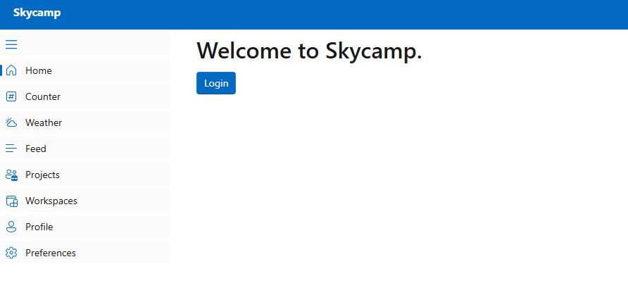
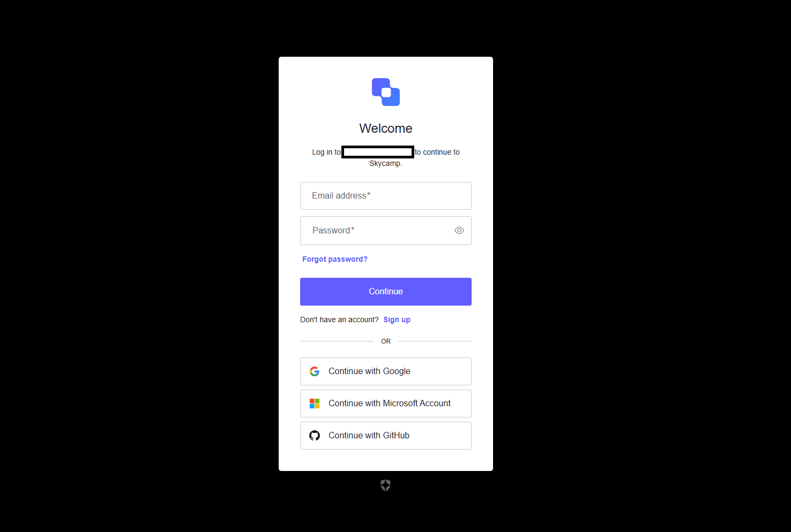
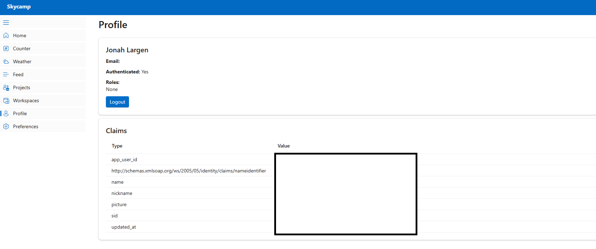
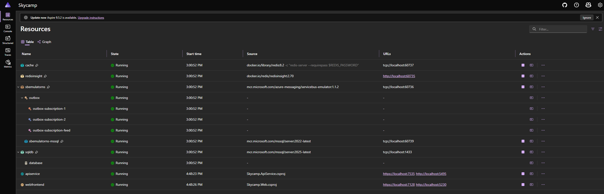
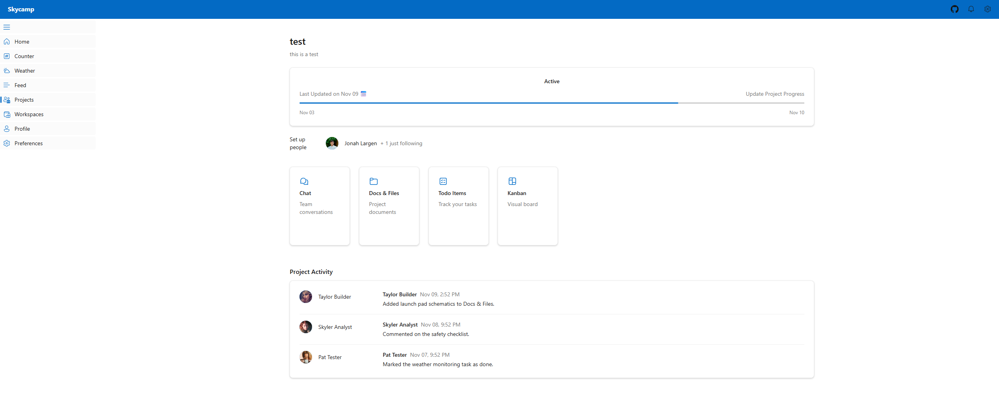
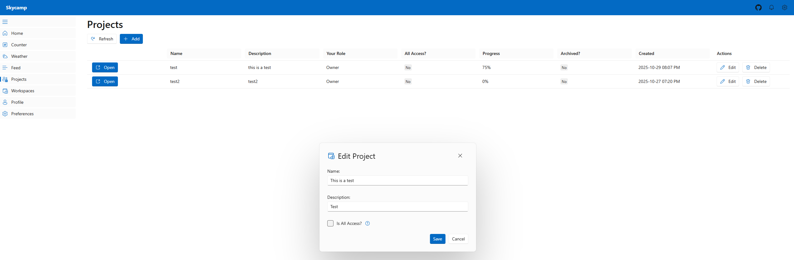
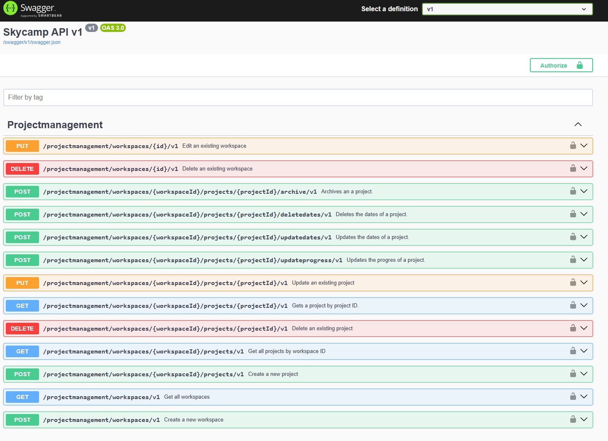

# Skycamp

Skycamp is a tongue-in-cheek, professional-grade proof-of-concept inspired by Basecamp — a modern project management tool. This repository demonstrates a template for a project management platform, built with the latest .NET and Blazor technologies.

---

## Overview

Skycamp is designed to showcase best practices in building scalable, maintainable, and secure web applications using the Microsoft stack. The project features a modular architecture, clean separation of concerns, and leverages modern frameworks and cloud-ready patterns.

---

## Key Technologies

- **Blazor UI**: Interactive, component-driven web UI using Blazor Server and Fluent UI
- **.NET 9**: Built on the latest stable .NET platform for performance and long-term support
- **Entity Framework Core**: Modern ORM for data access and migrations
- **Aspire**: Cloud-native patterns and distributed application support
- **Auth0 Integration**: Secure authentication and authorization using Auth0

---

## Project Structure

```
Skycamp/
├── Skycamp.Web/              # Blazor web application
├── Skycamp.ApiService/       # API service
├── Skycamp.AppHost/          # Aspire orchestration host
├── Skycamp.ServiceDefaults/  # Shared service defaults
├── Skycamp.Contracts/        # Shared contracts
└── Skycamp.Tests/            # Test project
```

---

## Getting Started

### Setup Instructions

1. For best compatibility, it is recommended to run Aspire projects through Visual Studio. Be sure to download VS, SSMS, .NET 9, & Docker. Make sure web development with Aspire/Blazor packages are included. Microsoft also officially supported VS code and the CLI to run Aspire, if you wish.
2. Clone the Repository
   ```bash
   git clone https://github.com/JonahLargen/Skycamp.git
   ```
3. Be sure to have docker desktop installed and running before starting the app host project. Aspire will automatically download and run the needed containers.
4. Create an auth0 individual application (free version will suffice) and review the Blazor quickstart to see how to seed the application. You will need to set up or obtain the following:

- Domain
- Client ID
- Client Secret
- Callback URL (ex. https://localhost:7128/callback)
- Logout URL (ex. https://localhost:7128)
- Authorize the API (to allow admin programatic login)
- Create an 'Admin' Role
- Create an internal superuser with the Admin role
- On the post login event, add the roles to the claims:

```js
exports.onExecutePostLogin = async (event, api) => {
   const namespace = 'https://api.skycamp.com';

  if (event.authorization) {
    api.accessToken.setCustomClaim(`${namespace}/roles`, event.authorization.roles);
  }
};
```

- In the API Authorization Settings, select Username-Password-Authentication as the default

**Note: Auth0 can require some tinkering depending on your application setup. Be sure to follow auth0's documentation for current best practices and setup. Skycamp requires a default blazor setup, plus a custom admin superuser for the admin client. This is because skycamp will directly access the Authentication API.**

5. Inside the aspire secrets/app settings, be sure to incoporate the environment variables so they are forwarded downstream to the applications that need them:

```json
{
...
"Auth0:SuperUserPassword": "...",
"Auth0:SuperUserEmail": "...",
"Auth0:Domain": "...",
"Auth0:ClientSecret": "...",
"Auth0:ClientId": "...",
"Auth0:Audience": "...",
...
}
```

6. Run the aspire host and login! It make take a while if it is creating your containers for the first time.

### Validating the Auth0 Workflow

You can test you setup auth0 right by following the login Workflow:

1. Go to the home page and click login.



2. Create an account and login, or use a social signin (if you configured them)



3. After logging in, it should take you to your profile



You will know you also setup the admin account correctly if no errors occur. This is because the token validated event uses the admin client to sync your user against the api (ef core identity db).

---

## Screenshots






---

## License

This project is licensed under the MIT License - see the [LICENSE](LICENSE) file for details.
