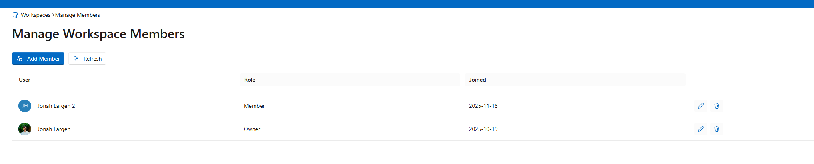
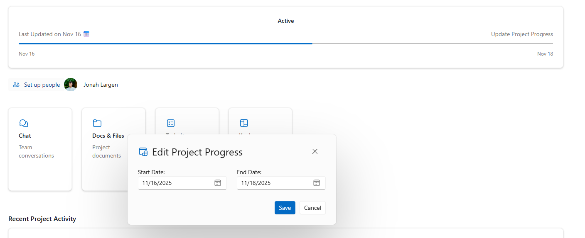
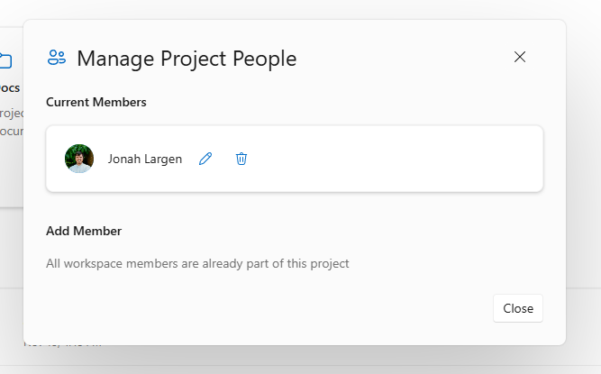
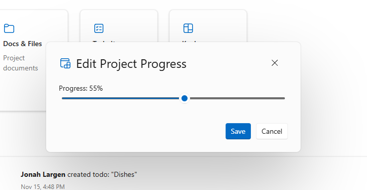
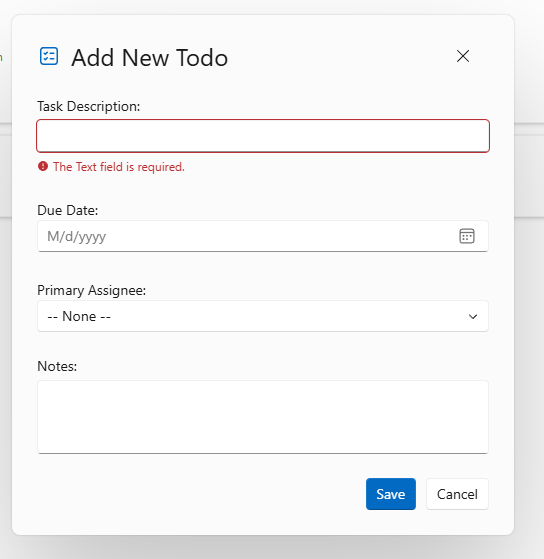

# 📸 Skycamp Screenshot Gallery

A comprehensive visual tour of Skycamp's features, architecture, and user interface.

---

## 🎯 Aspire Dashboard & Infrastructure

### Resource Dependency Graph

The Aspire Dashboard provides a visual representation of the entire distributed application. This graph view shows:
- **Service Dependencies**: How the Web Frontend, API Service, and infrastructure components connect
- **Resource Nodes**: SQL Server database, Redis cache, and Azure Service Bus
- **Health Status**: Real-time monitoring of each component's operational state
- **Connection Flow**: Visual tracing of requests across the service mesh

### Service Table View

The table view offers detailed metrics for each service:
- **Health Checks**: Live/ready status for all endpoints
- **Resource URLs**: Direct access to each service's endpoint
- **Container Status**: Docker container state and resource usage
- **OpenTelemetry Integration**: Links to distributed traces and logs

---

## 🏢 Workspace Management

### Workspaces Overview

The workspaces feature allows organizing multiple projects into logical groupings:
- **Role-Based Access**: Different permission levels (Owner, Admin, Member)
- **Member Management**: See who has access to each workspace
- **Project Count**: Quick overview of projects within each workspace
- **Create & Edit**: Fluent UI dialogs for workspace management

### Managing Workspace Members

Granular control over workspace access:
- **Role Assignment**: Assign Owner, Admin, or Member roles
- **User Search**: Easily add team members to workspaces
- **Permission Levels**: Control who can create projects, manage members, etc.
- **Real-time Updates**: Changes reflected immediately via SignalR

---

## 📋 Project Management

### Projects Dashboard

Central hub for all project management activities:
- **Project Cards**: Visual representation with key details
- **Status Indicators**: Track project progress at a glance
- **Deadline Tracking**: See upcoming milestones and due dates
- **Quick Actions**: Create, edit, and manage projects efficiently
- **Workspace Association**: Projects organized by their parent workspace

### Project Landing Page

Comprehensive project view built with Fluent Design:
- **Modern UI**: Clean, professional interface using Microsoft Fluent UI
- **Project Information**: Description, dates, and key metadata
- **Team Members**: See who's working on the project
- **Navigation**: Quick access to todos, activity feed, and settings
- **Responsive Design**: Works seamlessly across different screen sizes

### Project Settings & Configuration

Edit project details with full validation:
- **Form Validation**: FluentValidation ensures data integrity
- **Rich Text Editing**: Detailed project descriptions
- **Date Management**: Start and end date configuration
- **Access Control**: Only authorized users can modify settings
- **Auto-save**: Changes persisted immediately with optimistic UI updates

### Update Project Dates

Dedicated dialog for managing project timelines:
- **Date Pickers**: Intuitive date selection UI
- **Validation Rules**: Ensures end date is after start date
- **Quick Updates**: Modal dialog for efficient editing
- **Activity Tracking**: Date changes logged in activity feed

### Manage Project People

Control who has access to individual projects:
- **Add Team Members**: Invite users to collaborate on projects
- **Role Management**: Assign project-specific roles
- **Remove Members**: Revoke access when needed
- **Workspace Integration**: Members must be in the workspace first

### Update Project Progress

Track and update project status:
- **Progress Indicators**: Visual representation of completion
- **Status Updates**: Mark milestones and achievements
- **Team Communication**: Keep everyone informed of progress
- **Historical Tracking**: All updates logged in activity feed

---

## ✅ Todo & Task Management

### Project Todos

Comprehensive task tracking system:
- **Task Lists**: Organize todos within projects
- **Real-time Updates**: SignalR pushes changes to all connected users
- **Priority Management**: Sort and prioritize tasks
- **Assignment**: Assign todos to team members
- **Completion Tracking**: Mark tasks complete with timestamps
- **Fluent UI Controls**: Modern checkboxes and input fields

### Todo Validation

Client and server-side validation ensures data quality:
- **Required Fields**: Ensures todos have necessary information
- **Character Limits**: Prevents overly long descriptions
- **Real-time Feedback**: Validation errors shown immediately
- **FluentValidation**: Type-safe validation rules
- **User-Friendly Messages**: Clear guidance on fixing errors

---

## 📡 Real-Time Features

### Live Activity Feed

Real-time event stream powered by SignalR:
- **Live Updates**: See project activities as they happen
- **Event Types**: Project created, updated, todos completed, members added
- **User Attribution**: See who performed each action
- **Timestamps**: Precise tracking of when events occurred
- **Outbox Pattern**: Reliable event delivery via Azure Service Bus
- **Background Processing**: Events published asynchronously with Hangfire
- **Distributed Architecture**: Activity feed subscriber consumes events from message bus

The activity feed demonstrates several architectural patterns:
1. **Outbox Pattern**: Events saved to database in same transaction as business data
2. **Event-Driven Architecture**: Loose coupling between services
3. **SignalR Hub**: WebSocket connections for real-time push notifications
4. **Azure Service Bus**: Durable message queue with pub/sub
5. **Background Jobs**: Hangfire processes and publishes events asynchronously

---

## ⚙️ User Preferences

### Site Settings

Customizable user experience:
- **Theme Selection**: Light/dark mode support
- **Notification Settings**: Control what alerts you receive
- **Time Zone**: Configure display of dates and times
- **Profile Information**: Update user details
- **Persistent Settings**: Preferences saved in Redis cache
- **Instant Application**: Changes take effect immediately

---

## 🏗️ Architecture Showcase

This gallery demonstrates key architectural features:

### Distributed Systems
- **Service Orchestration**: Aspire coordinates multiple services
- **Service Discovery**: Automatic endpoint resolution
- **Health Monitoring**: Continuous health checks across all components

### Real-Time Communication
- **SignalR Hubs**: WebSocket connections for live updates
- **Event Broadcasting**: Push notifications to all connected clients
- **Connection Management**: Automatic reconnection handling

### Data Architecture
- **EF Core**: Entity Framework for data access
- **SQL Server**: Persistent storage with ACID guarantees
- **Redis Cache**: Distributed caching for performance
- **Outbox Pattern**: Reliable event publishing

### UI/UX Excellence
- **Fluent Design**: Microsoft's modern design system
- **Responsive Layouts**: Works on all screen sizes
- **Validation Feedback**: Immediate user feedback
- **Loading States**: Skeleton screens and spinners
- **Optimistic Updates**: UI updates before server confirmation

### Security & Access Control
- **Role-Based Authorization**: Granular permissions at workspace and project levels
- **Auth0 Integration**: OAuth 2.0 / OpenID Connect authentication
- **JWT Validation**: Secure API authentication
- **User Sync**: Automatic synchronization between Auth0 and local database

---

## 📚 Additional Resources

- [Main README](../README.md) - Project overview and setup instructions
- [Architecture Documentation](../README.md#-architecture--design-decisions) - Deep dive into architectural patterns
- [Getting Started Guide](../README.md#-getting-started) - Setup and configuration

---

**⭐ Showcasing modern .NET architecture and cloud-native patterns**

Built with ❤️ using .NET 9, Blazor, and Aspire

